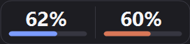
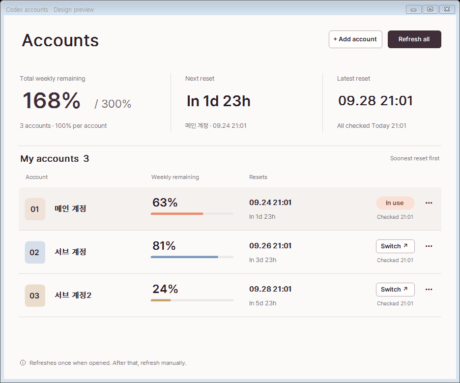
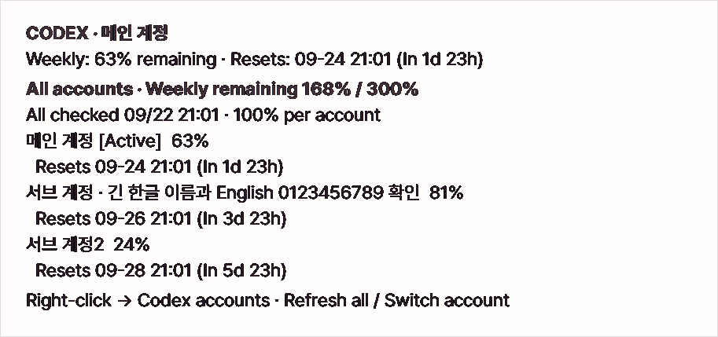

# Codex + Claude Usage Indicator

Keep your remaining Codex and Claude usage in sight, then check and switch your saved Codex accounts from one place.

**Windows · 한국어 / English · Manual account switching**



The blue bar is Codex; the orange bar is Claude Fable. The numbers show how much weekly usage remains. The widget stays visible while Codex is open, so you can check without leaving your work.



- **See what is left across your accounts.** The manager adds their remaining weekly percentages and shows which account resets next.
- **Check another account without switching.** Refresh one account or all accounts when you need an update.
- **Switch when you choose.** Pick an account, finish your Codex work and confirm the switch. The tool saves your logins for the next time.

Screenshots use synthetic accounts and usage. This is an unofficial community project.

[Download the Windows release](https://github.com/extsvforest/codex-weekly-usage-indicator/releases/latest) · [Installation](#install-from-a-release) · [Language](#language)

## What it does

<details>
<summary>Widget behavior and refresh details</summary>

- Appears while Codex Desktop is running and hides when Codex exits.
- Keeps the existing 272 × 64 window and uses one or two fluid panels depending on which providers are available.
- Shows only white remaining percentages: Codex is identified by a blue bar and Claude Fable by a terracotta-orange bar.
- Expands one successful provider to the full width when the other provider is unavailable.
- Shows Codex weekly reset details plus Claude 5-hour, weekly, and Fable reset details in a hover tooltip.
- Reads the weekly usage window from the local Codex app-server.
- Reads Claude limits through Claude Code's built-in `/usage` command with a ten-minute in-memory cache.
- Keeps one credential-free successful Claude snapshot locally for up to 24 hours so a rate-limited cold start does not blank the panel.
- Keeps the last successful Claude value visible during temporary rate limits or service errors and reports the delay in the tooltip.
- Refreshes every 60 seconds; double-click to refresh Codex immediately while Claude continues to honor its ten-minute cache.
- Supports dragging, copying the current values, toggling always-on-top, and turning the Claude panel on or off from the right-click menu.
- Remembers the last dragged position and restores it on the next launch.
- Switches the interface between Korean and English from **Language / 언어** in the widget or tray menu.
- Hides while another foreground app is fullscreen, then returns at the saved position.
- Uses a per-user Windows scheduled task at sign-in, so the widget runs independently of Codex. A lightweight supervisor restarts the widget after an abnormal exit, waiting one minute (up to 999 retries per supervisor run).

</details>

You can use the widget on its own. Saving accounts is optional; it adds the account manager shown above. Saved Codex logins are encrypted for your Windows user. Claude Code handles its own login. See [PRIVACY.md](PRIVACY.md) for storage details.

## Manual Codex accounts

Right-click the widget and open **Codex accounts… / Codex 계정 관리…**, or double-click its tray icon.

1. **Save the account you already use.** Choose **Save current account**. Open its **···** menu to give it a name you recognize.
2. **Add another account.** Choose **+ Add account** and complete the official sign-in in your browser. Your current Codex session stays signed in.
3. **Check the balances.** Opening the manager checks your saved accounts once. Press **Refresh all** for another complete check, or use a row's **···** menu to check just that account.
4. **Switch when you are ready.** Press **Switch** on the account you want. Save your work and close Codex Desktop and any Codex terminal or IDE sessions. The confirmation button becomes available when they have stopped; it applies the saved login and tries to reopen Codex. Check that Codex shows the intended account.

The list puts the soonest reset first. Three accounts fit in the default window on a sufficiently tall display; a smaller window can scroll. Names appear here and in hover details, while the small widget stays focused on percentages.

Hover details open outside the widget after a short delay and stay in place while you read. New observations appear on the next hover; moving away, dragging, or opening the context menu closes the details. The hover window never takes keyboard focus.



In the example above, the accounts have **63%, 81% and 24%** left. Adding them gives **168% out of 300%**. Each full account contributes 100%, so this helps you compare the saved balances. Accounts on different plans can have different actual quotas; the sum does not measure an equal number of messages or tokens.

**Next reset** tells you which account resets first. **Latest reset** shows the last reset among the accounts. Each balance still follows its own reset time, so the latest date is not a deadline for spending the whole 168%.

Other accounts are checked when you open the manager or request a refresh. Moving the mouse, changing the language or returning to the window does not request another check. If a check fails or a reset has passed, the manager marks what needs attention instead of presenting an old balance as a current total.

<details>
<summary>Refresh rules, saved logins and recovery</summary>

Opening a new manager window starts one sequential usage query for all registered accounts. After that, **전체 갱신** is the only way to refresh the whole observation set. Restoring focus, changing selection, the local five-second UI timer, and the active widget's own polling do not trigger another batch or change this snapshot. Closing the window during a batch cancels the request and waits for safe cleanup. Failure, cancellation, missing/expired weekly data, or changed membership withholds the total and distinguishes the confirmed subtotal from previous values. Cleanup or credential recovery stops the remaining batch.

Choose **현재 계정 등록** to save the current login with a default name. The **···** menu on each account contains **이름 변경**, **이 계정 사용량 조회**, **상세 정보**, and **저장된 로그인 삭제**. Enter saves a name and Escape cancels. Renaming only changes local metadata. The detail dialog contains the masked identity and latest 5-hour observation. An individual usage read updates that row and marks the overall total for a new full refresh; other observations retain their check times, while the total requires a full refresh so separate checks cannot silently masquerade as one complete batch. A background active-account poll does not alter the manager's observation set.

Choose **+ 계정 추가**, optionally name the account, then select **브라우저에서 로그인**. Complete the official browser login using the additional account. This login uses an isolated private `CODEX_HOME` and does not log the desktop out; **로그인 취소** stops only the login process owned by this tool. If you sign into an unregistered account directly in Codex, the manager offers registration above the list.

Click **전환** on the desired account. The preparation dialog shows the source and target names and waits while you finish your work and close Codex Desktop and other Codex CLI/engine processes. **전환하고 Codex 열기** becomes available when they have stopped; cancellation keeps the current login. The widget suspends its own helper, checks for remaining writers, preserves the latest current login and applies the selected login, then attempts to reopen Codex. Confirm the account there; file application and desktop login verification are separate outcomes. The widget's show/re-show and topmost maintenance preserve keyboard focus in other apps.

Inactive usage reads use a short-lived official app-server in a private isolated home. Codex Desktop and the current account stay signed in, and the current helper is not suspended. Active-account reads reuse that helper and require Codex Desktop to be open. A timeout, cancellation or failed request preserves the last successful observation; refreshed credentials are saved even when usage retrieval fails. Expired inactive logins can be renewed through **+ 계정 추가** with that same account; renew the active login in Codex. The manager's background context menu can reload the saved account list without requesting usage.

Only explicit selections cause a switch. There is no automatic quota rotation, proxy, inactive-account background polling, quota pooling, usage history, or per-person attribution. Values past their reset time are marked **갱신 필요**. A pending switch transaction blocks polling until **미완료 전환 복구** reconciles it with actual live authentication. A query interrupted before credentials are safely saved offers **중단된 조회 복구**; finish Codex work and close remaining Codex writers before this exceptional recovery. Its encrypted journal preserves refreshed credentials before staging is removed. Recovery never overwrites newer live authentication.

If credentials are already saved and only temporary files remain, the manager instead shows **임시 파일 정리 대기** with an **임시 파일 정리** button. This cleanup can run while Codex stays open and does not block account editing or switching. The next inactive usage request also retries cleanup before starting. A temporary file lock is retried automatically; a persistent failure displays its category and code. Cleanup does not turn a failed or canceled usage request into a success, and periodic list refresh preserves the original result. The management window supports display scaling, and its account list scrolls when the window is made smaller.

The first version supports local Windows file-based ChatGPT authentication. Unsupported keyring/managed configurations fail closed. The vault is stored separately at `%LOCALAPPDATA%\CodexWeeklyUsageIndicator.Accounts`; uninstall preserves it. Delete inactive accounts from the manager before removing the app if you no longer want their saved credentials. This convenience tool does not establish that any particular multi-account usage pattern is permitted by the service terms.

</details>

> [!IMPORTANT]
> This is an unofficial community project. It relies on an experimental local Codex app-server method (`account/rateLimits/read`) and the text output of Claude Code's built-in `/usage` command. Either may change without notice.

## Language

Right-click the widget or tray icon, then choose **Language / 언어 → 한국어 / English**. Menus, account management, dialogs, usage details and known application errors change immediately. An open idle account manager keeps its size and last usage observation when the language changes; changing language does not request usage or sign you in again. Finish or cancel an account operation or close its dialog before changing language.

The choice is saved locally. Existing installations with a settings file keep Korean; a new installation starts in Korean on Korean Windows and English otherwise. Account names, identities, credentials and usage values are not translated. Windows-provided confirmation buttons follow the Windows display language. Diagnostic text supplied by the operating system or an external tool may remain in its original language.

## Requirements

- Windows 10 or 11
- Codex Desktop installed and signed in
- Optional: a recent native Claude Code for Windows that supports `/usage` and `--safe-mode`, installed and signed in, to add Claude/Fable usage
- [.NET 8 Desktop Runtime](https://dotnet.microsoft.com/download/dotnet/8.0)
- .NET 8 SDK only when building from source

## Install from a release

1. Download and extract the Windows zip from [Releases](https://github.com/extsvforest/codex-weekly-usage-indicator/releases).
2. Review the included PowerShell scripts.
3. Open a standalone Windows PowerShell window (outside packaged apps such as Codex), change to the extracted directory, and run:

```powershell
.\scripts\install.ps1
```

The app is installed to `%LOCALAPPDATA%\CodexWeeklyUsageIndicator`. A per-user `CodexWeeklyUsageIndicator-<Windows SID>` scheduled task starts its supervisor at sign-in, using the signed-in user's normal privileges without storing a password. The supervisor launches and watches the widget; two processes from the same EXE are expected, but only one window. Installation also starts the task immediately, checks that both processes appear, and then removes the old Startup shortcut. Windows Task Scheduler must be available; an installation error must be resolved before relying on automatic recovery.
The saved window position, Claude visibility preference and UI language are kept locally in `settings.json` inside that install directory. One sanitized Claude recovery snapshot may be kept in `claude-usage-cache.json` and is ignored after 24 hours or after its Fable reset.

Run installation and removal outside packaged app terminals: Windows can redirect their AppData writes into an app-private folder that Task Scheduler cannot see, causing `0x80070002` even when that terminal reports the EXE exists. Both scripts check the real directory path and refuse redirected locations before changing tasks or running widgets.

To uninstall:

```powershell
.\scripts\uninstall.ps1
```

Release binaries are currently unsigned, so Windows may display a warning. SHA-256 checksums are included with each release.

Choosing **종료** from the widget menu exits normally and also ends the supervisor. It starts again at your next Windows sign-in. To start it sooner with recovery enabled, run its `CodexWeeklyUsageIndicator-<Windows SID>` task in Windows Task Scheduler or run `scripts\install.ps1` again. Launching the EXE directly does not enable supervision for that process. Stopping the scheduled task or killing the supervisor also stops automatic recovery until the task is started again. Uninstall removes the scheduled task before deleting the app.

## Build from source

```powershell
.\scripts\build.ps1
```

The executable is written to `dist\WeeklyUsageIndicator.exe`. Release builds omit debug paths and symbols.

## How it works

The WinForms process checks for the packaged Codex Desktop host. While Codex is active, it launches `codex app-server --stdio`, initializes the local JSONL protocol, and reads `account/rateLimits/read`. It selects the rate-limit window closest to seven days and renders the remaining percentage.

For Claude, it runs the local native executable with `claude -p --safe-mode --no-session-persistence --no-chrome /usage --output-format json --max-turns 0`. Safe mode prevents personal hooks, plugins, MCP servers, and project instructions from affecting the lookup. Claude Code handles its own authentication and token refresh, while the widget parses the returned 5-hour, all-model weekly, and Fable weekly windows. Agentic turns are disabled, the widget also rejects any response that reports a model turn or non-zero cost, and successful results are cached in memory for ten minutes.

The latest successful percentages, reset times, and update time are also written to `claude-usage-cache.json` without credentials or account identifiers. A new process still invokes Claude Code immediately; the local snapshot is used only when that command is temporarily unavailable, and is rejected after 24 hours or after its Fable reset. Authentication or response-schema failures delete it rather than showing data Claude Code has rejected.

If the account does not expose a Fable-specific weekly limit, or one provider fails to refresh, that provider is omitted from the compact surface. Turning off **Claude 사용량 표시** also skips the Claude command until it is turned on again.

Claude percentages remain valid when `/usage` omits reset times (for example, `Current session: 0% used`). Missing or unrecognized reset times appear as unknown. The 5-hour and all-model weekly windows are parsed independently, so an unavailable optional window does not hide a valid Fable percentage.

Temporary Claude Code, network, or service failures keep the last successful Claude value visible while the tooltip shows the last update and next retry time.

The app-server child process is stopped whenever Codex is no longer running.

## Project files

- `src/` — WinForms application
- `scripts/` — build, install, and uninstall helpers
- `wireframes/` — compact widget UI specification
- `.github/workflows/` — clean Windows builds and tagged releases
- `AGENTS.md` — guidance for coding agents

## License

[MIT](LICENSE). Bundled Pretendard fonts use the SIL Open Font License; see [THIRD_PARTY_NOTICES.txt](THIRD_PARTY_NOTICES.txt).
